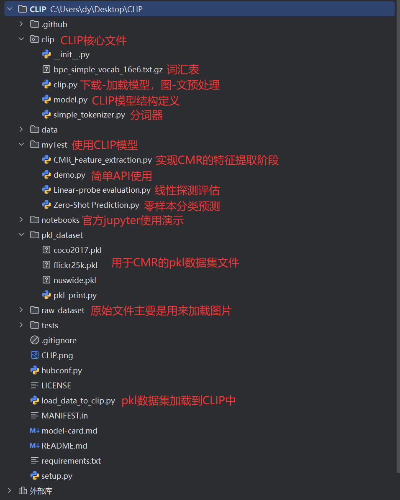

# CLIP

[[Blog]](https://openai.com/blog/clip/) [[Paper]](https://arxiv.org/abs/2103.00020) [[Model Card]](model-card.md) [[Colab]](https://colab.research.google.com/github/openai/clip/blob/master/notebooks/Interacting_with_CLIP.ipynb)
本项目使用预训练CLIP进行特征提取

## 统一数据索引

`pkl_dataset/` 中的 pickle 文件统一包含 `indexs`、`captions` 和 `labels`。其中 `coco_val2017.pkl` 由 COCO 2017 官方 `val2017` 派生：原始目录有 5,000 张图片，统一索引排除 48 张没有目标标签的图片，最终包含 4,952 个样本、24,774 条 caption 和 80 维多热标签。图片相对路径保持为 `val2017/<文件名>.jpg`，caption 保留官方每图实际的 5--7 条记录。

## Approach

## 项目结构如下

## See Also

* [OpenCLIP](https://github.com/mlfoundations/open_clip): includes larger and independently trained CLIP models up to ViT-G/14
* [Hugging Face implementation of CLIP](https://huggingface.co/docs/transformers/model_doc/clip): for easier integration with the HF ecosystem
